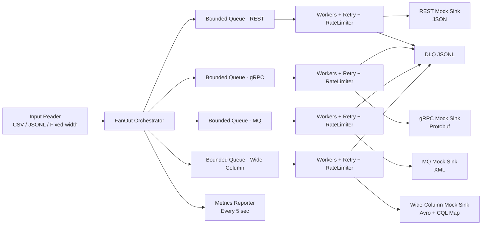

# Architecture

## Data Flow

## Core Components

- `InputReaderFactory` builds streaming readers for CSV, JSONL, and fixed-width sources.
- `SinkPluginRegistry` maps sink types to strategy pairs (`Transformer` + `Sink`) so fan-out is extensible.
- `FanOutEngine` orchestrates ingestion, fan-out dispatch, worker lifecycle, and data-loss verification.
- `SinkWorker` enforces retry policy, backoff, throttling, and DLQ fallback.
- `TokenBucketRateLimiter` provides configurable per-sink rate limits.
- `MetricsCollector` tracks ingestion, throughput, and per-sink success/failure metrics.

## Extensibility Contract

To add a new sink without changing orchestrator logic:
1. Implement `SinkPlugin<T>`.
2. Register it with `SinkPluginRegistry`.
3. Add sink config entry in `application.yaml`.

No changes to `FanOutEngine` are required.
